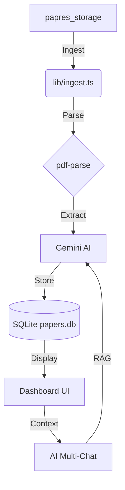

# 🎓 Scholar.AI

**Scholar.AI** is a premium, local-first research management platform that uses AI to automate the tedious parts of handling institutional research papers. 

It provides a seamless workflow from raw PDF ingestion to deep AI-driven insights.

---

## ✨ Key Features

- 🕵️ **Automated Metadata Extraction**: Automatically identifies titles, authors, journals, and key findings from PDFs using Google Gemini AI.
- 🧘 **Human-in-the-Loop Review**: A dedicated "Review Queue" let's you verify and approve AI-generated metadata before it joins your permanent library.
- 💬 **AI Multi-Chat (RAG)**: Select multiple papers and chat with them simultaneously. Synthesize insights across documents with a research-aware AI co-pilot.
- 📖 **Split-Pane PDF Viewer**: Read your documents alongside your chat or dashboard with a high-performance integrated viewer.
- 🛡️ **Privacy & Security**: Built with a privacy-first approach. All PDFs and local SQLite databases are automatically excluded from Git tracking.

---

## 🛠️ Tech Stack

- **Framework**: [Next.js 15+](https://nextjs.org/) (App Router)
- **UI**: [React 19](https://react.dev/), [Tailwind CSS v4](https://tailwindcss.com/)
- **Animations**: [Framer Motion](https://www.framer.com/motion/)
- **Database**: [SQLite](https://www.sqlite.org/) (Local-first)
- **AI Integration**: [LangChain](https://www.langchain.com/) & [Google Gemini SDK](https://ai.google.dev/)
- **Icons**: [Lucide React](https://lucide.dev/)

---

## 🚀 Getting Started

### 1. Prerequisites
- Node.js 18.x or higher
- A [Google Gemini API Key](https://aistudio.google.com/app/apikey)

### 2. Installation
Clone the repository and install dependencies:
```bash
git clone https://github.com/soi130/research_scholar.git
cd paper-library-app
npm install
```

### 3. Configuration
Rename `.env.local.example` to `.env.local` and add your details:
```env
GEMINI_API_KEY=your_key_here
PAPERS_STORAGE_PATH=/path/to/your/pdf/folder
```

### 4. Run the App
```bash
npm run dev
```
Open [http://localhost:3000](http://localhost:3000) in your browser.

---

## 🏗️ Project Architecture



---

## 🛡️ Data Security Policy

To protect copyrighted material and local state, this project includes a robust `.gitignore` strategy:
- **`*.pdf`**: All research papers are ignored by default.
- **`papers.db*`**: Your local metadata database stays on your machine.
- **`/papres_storage`**: The source ingestion folder is explicitly excluded.

---

## 📜 License
This project is for private research use. Please ensure you have the rights to use the PDF documents you ingest.

---

## Checkpoint Notes

- The review/dashboard pipeline now includes richer extraction for summary, 3 KTAs, key-call rows, and structured topic sentiment.
- A known open issue remains in numeric extraction: the model can still confuse `forecast` numbers with `outturn` or realized/review numbers.
- Next follow-up:
  tighten the extraction prompt and post-processing so papers reviewing released CPI, exports, GDP, etc. do not get mislabeled as forward forecasts unless the paper explicitly presents a true forecast.
